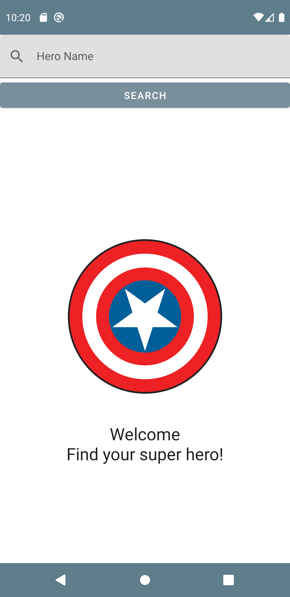
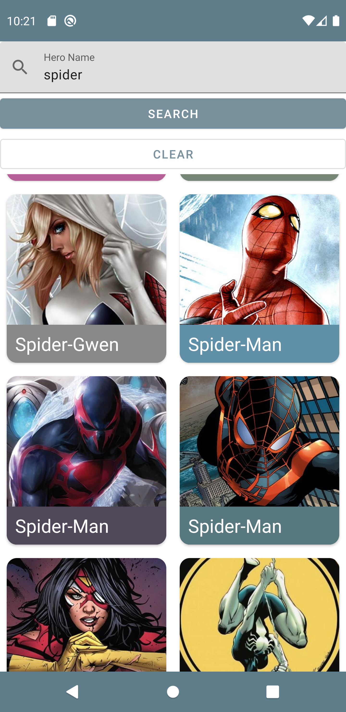
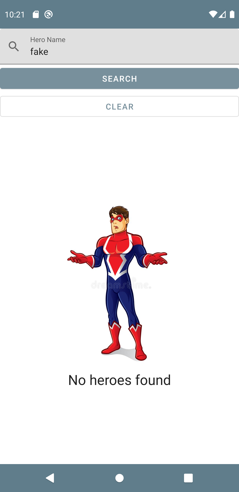
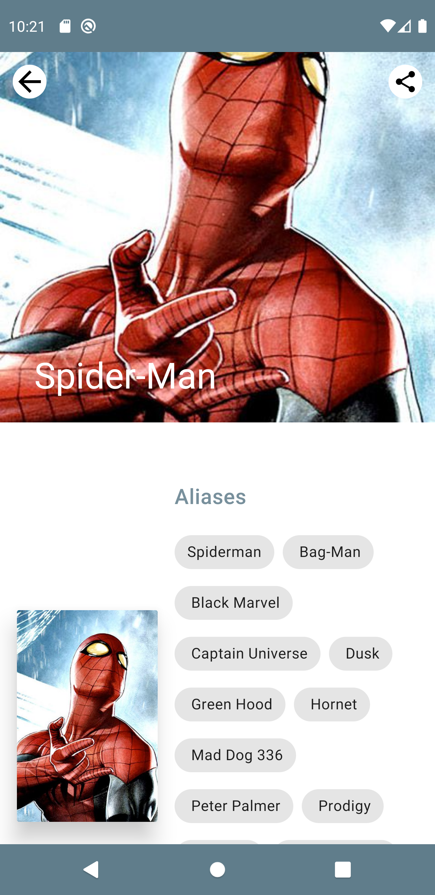
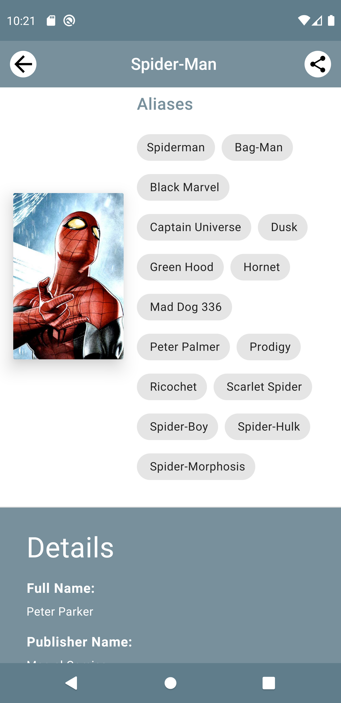
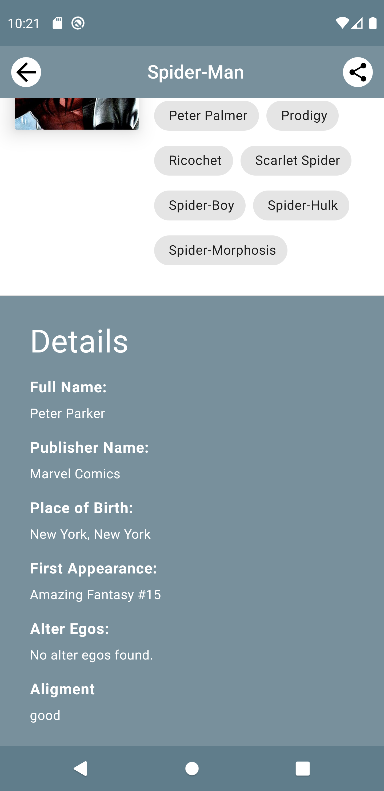

Android SuperHero
=================

A super hero app illustrating Android development best practices with Android Jetpack.

Introduction
------------

This app let's you search for super heroes and share details with others.


Getting Started
---------------
This project uses the Gradle build system. To build this project, use the
`gradlew build` command or use "Import Project" in Android Studio.

### Superhero API key

SuperHero uses the [SuperHero API](https://superheroapi.com/) to load superheroes.
To use the API, you will need to obtain a free developer API key. See the
[SuperHere API Documentation](https://superheroapi.com/) for instructions.

Once you have the key, add this line to the `apikey.properties` file

```
API_KEY=<your SuperHero access key>
```
Screenshots
-----------



Libraries Used
--------------
* Architecture - A collection of libraries that help you design robust, testable, and
  maintainable apps. Start with classes for managing your UI component lifecycle and handling data
  persistence.
  * Lifecycles - Create a UI that automatically responds to lifecycle events.
  * LiveData - Build data objects that notify views when the underlying database changes.
  * Navigation- Handle everything needed for in-app navigation.
  * ViewModel - Store UI-related data that isn't destroyed on app rotations. Easily schedule
     asynchronous tasks for optimal execution.
* Third party and miscellaneous libraries
  *  Glide  for image loading
  *  Hilt for dependency injection
  *  Kotlin Coroutines for managing background threads with simplified code and reducing needs for callbacks
  
Android Studio IDE setup
------------------------
For development, the latest version of Android Studio is required. The latest version can be
downloaded from [here](https://developer.android.com/studio/).

SuperHero uses [ktlint](https://ktlint.github.io/) to enforce Kotlin coding styles.
Here's how to configure it for use with Android Studio (instructions adapted
from the ktlint [README](https://github.com/shyiko/ktlint/blob/master/README.md)):

- Close Android Studio if it's open

- Download ktlint using these [installation instructions](https://github.com/pinterest/ktlint/blob/master/README.md#installation)

- Apply ktlint settings to Android Studio using these [instructions](https://github.com/pinterest/ktlint/blob/master/README.md#-with-intellij-idea)

- Start Android Studio
